# 🚀 Microsoft Azure & Fabric Bill Analyzer - Enhanced Edition
## Visual Workflow Diagrams

**Powered by [Semanticise Inc.](https://semanticise.com/)**

---

## 📊 Interactive Mermaid Diagrams

For the complete visual workflow experience, copy any of the mermaid diagrams below into:
- **Mermaid Live Editor**: https://mermaid.live/
- **GitHub/GitLab**: Paste directly in markdown files
- **VS Code**: With Mermaid extension
- **Documentation platforms**: Most support mermaid rendering

---

## 🎯 Diagram 1: Complete User Workflow

```mermaid
flowchart TD
    A[🏁 START: User has Azure/Fabric billing data] --> B[📥 Obtain Azure billing CSV<br/>Portal → Subscription → Billing → Invoices]
    
    B --> C{📋 Data Format Check<br/>Required Columns?}
    C -->|✅ Valid Format| D[🚀 Choose Launch Method]
    C -->|❌ Invalid Format| E[❌ Fix data format<br/>Need: MeterCategory, ConsumedService,<br/>ResourceName, Cost]
    E --> B
    
    D --> F[🖥️ Web App<br/>python run_app.py<br/>🌟 Recommended]
    D --> G[💻 Command Line<br/>python cli.py<br/>⚡ Advanced Users]
    D --> H[🔧 Direct Launch<br/>python app.py<br/>🛠️ Manual Setup]
    
    F --> I[🌐 Web Dashboard<br/>http://localhost:5000]
    G --> J[📊 CLI Analysis & Export]
    H --> I
    
    I --> K[📤 Upload File<br/>Drag & Drop or Browse]
    K --> L{✅ File Validation<br/>Size < 16MB?<br/>Valid CSV/Excel?}
    L -->|❌ Validation Failed| M[❌ Show Error Message<br/>• Check file format<br/>• Verify columns<br/>• Check file size]
    L -->|✅ Validation Passed| N[🔍 Choose Analysis Type]
    M --> K
    
    N --> O[📊 Full Analysis<br/>Complete Dashboard]
    N --> P[🔍 Search Data<br/>Find Specific Resources]  
    N --> Q[🎛️ Advanced Filters<br/>Multi-dimensional Filtering]
    
    O --> R[📈 Interactive Dashboard<br/>• Key Metrics<br/>• Interactive Charts<br/>• Combined Sorted Report]
    P --> S[🔎 Search Results<br/>• Highlighted Matches<br/>• Export Options]
    Q --> T[🎚️ Filtered Results<br/>• Real-time Updates<br/>• Custom Subsets]
    
    R --> U[📊 Explore Features<br/>• Service Pie Chart<br/>• Category Bar Chart<br/>• Top Resources<br/>• Cost Histogram<br/>• Sunburst Chart]
    S --> U
    T --> U
    
    U --> V{📤 Choose Export Format}
    V --> W[📋 Excel Report<br/>7 comprehensive sheets<br/>Complete analysis]
    V --> X[📄 BillSort CSV<br/>Combined sorted report<br/>Category↑ Service↑ Cost↓]  
    V --> Y[🔍 Custom Export<br/>Search/Filter results<br/>Targeted data]
    
    W --> Z[💼 Business Analysis<br/>• Cost optimization<br/>• Trend analysis<br/>• Stakeholder reports]
    X --> Z
    Y --> Z
    
    Z --> AA{🔄 Continue Analysis?}
    AA -->|Yes - New Data| B
    AA -->|Yes - Same Data| N
    AA -->|No| BB[🎯 END: Successful Analysis<br/>✅ Reports generated<br/>✅ Insights gained<br/>✅ Action items identified]
    
    J --> CC[📊 CLI Results Display]
    CC --> DD{📤 Export from CLI?}
    DD -->|Yes| EE[📋 Generate Export Files<br/>• Excel reports<br/>• CSV exports<br/>• Combined reports]
    DD -->|No| FF[📺 View CLI Results<br/>Terminal output]
    EE --> AA
    FF --> AA
    
    style A fill:#e1f5fe,stroke:#01579b,stroke-width:2px
    style BB fill:#c8e6c9,stroke:#2e7d32,stroke-width:2px
    style R fill:#fff3e0,stroke:#f57c00,stroke-width:2px
    style U fill:#f3e5f5,stroke:#7b1fa2,stroke-width:2px
    style Z fill:#e8f5e8,stroke:#388e3c,stroke-width:2px
    style F fill:#e8f5e8,stroke:#4caf50,stroke-width:2px
    style G fill:#fff3e0,stroke:#ff9800,stroke-width:2px
    style H fill:#fce4ec,stroke:#e91e63,stroke-width:2px
```

---

## 🎨 Diagram 2: Feature Interaction Map

```mermaid
graph TB
    subgraph "Core Analysis Engine"
        A[📊 Data Processing<br/>• CSV/Excel parsing<br/>• Data validation<br/>• Statistical analysis]
    end
    
    subgraph "Interactive Features"
        B[📈 Interactive Charts<br/>• Plotly visualizations<br/>• Hover details<br/>• Click interactions]
        C[🔍 Search & Filter<br/>• Global search<br/>• Advanced filtering<br/>• Real-time results]
        D[📋 Combined Sorted Report<br/>• Smart sorting algorithm<br/>• Category→Service→Cost<br/>• Standardized format]
    end
    
    subgraph "Export & Integration"
        E[📤 Multi-format Export<br/>• Excel workbooks<br/>• CSV files<br/>• Custom formats]
        F[🔌 REST API<br/>• JSON endpoints<br/>• Automation ready<br/>• Third-party integration]
    end
    
    subgraph "User Interfaces"
        G[🌐 Web Dashboard<br/>• Responsive design<br/>• Intuitive navigation<br/>• Real-time updates]
        H[💻 CLI Interface<br/>• Batch processing<br/>• Scripting support<br/>• Advanced options]
    end
    
    A --> B
    A --> C
    A --> D
    B --> E
    C --> E
    D --> E
    E --> F
    G --> A
    H --> A
    B --> G
    C --> G
    D --> G
    
    style A fill:#e3f2fd,stroke:#1976d2,stroke-width:2px
    style B fill:#f3e5f5,stroke:#7b1fa2,stroke-width:2px
    style C fill:#e8f5e8,stroke:#388e3c,stroke-width:2px
    style D fill:#fff3e0,stroke:#f57c00,stroke-width:2px
    style E fill:#fce4ec,stroke:#e91e63,stroke-width:2px
    style F fill:#e0f2f1,stroke:#00796b,stroke-width:2px
    style G fill:#f9fbe7,stroke:#689f38,stroke-width:2px
    style H fill:#fff8e1,stroke:#fbc02d,stroke-width:2px
```

---

## 🗺️ Diagram 3: User Journey Map

---

## 🏗️ Diagram 4: Data Flow Architecture

```mermaid
graph LR
    subgraph "Input Layer"
        A[📄 Azure Billing CSV<br/>Required Columns:<br/>• MeterCategory<br/>• ConsumedService<br/>• ResourceName<br/>• Cost]
        B[📊 Excel Files<br/>Multiple sheets<br/>supported]
    end
    
    subgraph "Processing Layer"
        C[🔍 Data Validation<br/>• Column verification<br/>• Data type checking<br/>• Error handling]
        D[📊 Analysis Engine<br/>• Statistical analysis<br/>• Grouping & sorting<br/>• Calculations]
        E[🎨 Chart Generation<br/>• Plotly integration<br/>• Interactive features<br/>• Export ready]
    end
    
    subgraph "Output Layer"
        F[🌐 Web Dashboard<br/>• Interactive charts<br/>• Real-time filtering<br/>• Responsive design]
        G[📋 Excel Reports<br/>• 7 comprehensive sheets<br/>• Formatted tables<br/>• Ready for business use]
        H[📄 BillSort CSV<br/>• Smart sorting<br/>• Standardized format<br/>• Integration ready]
        I[🔌 REST API<br/>• JSON responses<br/>• Automation support<br/>• Third-party integration]
    end
    
    A --> C
    B --> C
    C --> D
    D --> E
    D --> F
    D --> G
    D --> H
    D --> I
    E --> F
    
    style A fill:#e1f5fe,stroke:#01579b,stroke-width:2px
    style B fill:#e1f5fe,stroke:#01579b,stroke-width:2px
    style C fill:#fff3e0,stroke:#f57c00,stroke-width:2px
    style D fill:#f3e5f5,stroke:#7b1fa2,stroke-width:2px
    style E fill:#e8f5e8,stroke:#388e3c,stroke-width:2px
    style F fill:#fce4ec,stroke:#e91e63,stroke-width:2px
    style G fill:#e0f2f1,stroke:#00796b,stroke-width:2px
    style H fill:#f9fbe7,stroke:#689f38,stroke-width:2px
    style I fill:#fff8e1,stroke:#fbc02d,stroke-width:2px
```

---

## 🌳 Diagram 5: Decision Tree for Analysis Methods

```mermaid
graph TD
    A[📊 Start Analysis] --> B{What's your goal?}
    
    B -->|Complete Overview| C[📈 Full Dashboard Analysis]
    B -->|Find Specific Items| D[🔍 Search Analysis]
    B -->|Custom Data Subset| E[🎛️ Advanced Filtering]
    B -->|Automation/Integration| F[💻 CLI/API Approach]
    
    C --> G[Interactive Charts<br/>• Service pie chart<br/>• Category bar chart<br/>• Top resources<br/>• Cost histogram<br/>• Sunburst view]
    
    D --> H[Search Results<br/>• Keyword matching<br/>• Highlighted results<br/>• Filtered exports]
    
    E --> I[Filtered Dashboard<br/>• Real-time filtering<br/>• Multi-dimensional<br/>• Custom exports]
    
    F --> J[Automated Processing<br/>• Batch analysis<br/>• Scripted exports<br/>• API integration]
    
    G --> K{Export Needs?}
    H --> K
    I --> K
    J --> K
    
    K -->|Comprehensive Report| L[📋 Excel Export<br/>7-sheet workbook]
    K -->|Standard Format| M[📄 BillSort CSV<br/>Smart sorted data]
    K -->|Custom Data| N[🎯 Filtered Export<br/>Targeted subset]
    
    L --> O[📊 Business Analysis]
    M --> O
    N --> O
    
    O --> P[🎯 Action Items<br/>• Cost optimization<br/>• Budget planning<br/>• Trend monitoring]
    
    style A fill:#e1f5fe,stroke:#01579b,stroke-width:2px
    style O fill:#c8e6c9,stroke:#2e7d32,stroke-width:2px
    style P fill:#c8e6c9,stroke:#2e7d32,stroke-width:2px
    style C fill:#fff3e0,stroke:#f57c00,stroke-width:2px
    style D fill:#f3e5f5,stroke:#7b1fa2,stroke-width:2px
    style E fill:#e8f5e8,stroke:#388e3c,stroke-width:2px
    style F fill:#fce4ec,stroke:#e91e63,stroke-width:2px
```

---

## 📤 Diagram 6: Export Options Flowchart

```mermaid
graph TB
    A[📤 Export Decision Point] --> B{Choose Export Format}
    
    B -->|Complete Analysis| C[📋 Excel Export]
    B -->|Standardized Data| D[📄 BillSort CSV]
    B -->|Custom Subset| E[🎯 Filtered Export]
    B -->|Integration| F[🔌 API Access]
    
    C --> C1[📊 Summary Sheet<br/>Key metrics & overview]
    C --> C2[🏢 By Service Sheet<br/>Service-level analysis]
    C --> C3[📦 By Category Sheet<br/>Category breakdown]
    C --> C4[🔧 By Resource Sheet<br/>Resource details]
    C --> C5[🆕 Combined Sorted Sheet<br/>Smart sorting algorithm]
    C --> C6[🏆 Top Costs Sheet<br/>Highest cost items]
    C --> C7[📊 Raw Data Sheet<br/>Original dataset]
    
    D --> D1[📄 Standardized Format<br/>MeterCategory, ConsumedService,<br/>ResourceName, Cost]
    D --> D2[🔄 Smart Sorting<br/>Category↑ → Service↑ → Cost↓]
    D --> D3[🔗 Integration Ready<br/>Standard format for<br/>other tools/systems]
    
    E --> E1[🔍 Search Results<br/>Keyword-filtered data]
    E --> E2[🎛️ Filter Results<br/>Multi-criteria filtered data]
    E --> E3[📊 Custom Analysis<br/>User-defined subsets]
    
    F --> F1[📊 GET /api/stats/<br/>Basic statistics JSON]
    F --> F2[📋 GET /api/combined_report/<br/>Sorted report JSON]
    F --> F3[📤 GET /export_excel/<br/>Download Excel file]
    F --> F4[📄 GET /export_combined_csv/<br/>Download BillSort CSV]
    
    style A fill:#e1f5fe,stroke:#01579b,stroke-width:2px
    style C fill:#e8f5e8,stroke:#388e3c,stroke-width:2px
    style D fill:#fff3e0,stroke:#f57c00,stroke-width:2px
    style E fill:#f3e5f5,stroke:#7b1fa2,stroke-width:2px
    style F fill:#fce4ec,stroke:#e91e63,stroke-width:2px
```

---

## 🛠️ Diagram 7: Troubleshooting Decision Tree

```mermaid
graph TD
    A[❌ Problem Encountered] --> B{What type of issue?}
    
    B -->|Installation| C[🔧 Dependency Issues]
    B -->|File Upload| D[📤 Upload Problems]
    B -->|Data Processing| E[📊 Analysis Errors]
    B -->|Display Issues| F[🖥️ UI Problems]
    
    C --> C1{Error: Module not found?}
    C1 -->|Yes| C2[💡 Run: pip install -r requirements.txt]
    C1 -->|No| C3[💡 Check Python version ≥ 3.7]
    
    D --> D1{File too large?}
    D1 -->|Yes| D2[💡 Use CLI for files > 16MB]
    D1 -->|No| D3[💡 Check file format: CSV/Excel only]
    
    E --> E1{Missing required columns?}
    E1 -->|Yes| E2[💡 Ensure columns:<br/>MeterCategory, ConsumedService,<br/>ResourceName, Cost]
    E1 -->|No| E3[💡 Check Cost column is numeric]
    
    F --> F1{Charts not loading?}
    F1 -->|Yes| F2[💡 Clear browser cache<br/>Check internet connection]
    F1 -->|No| F3[💡 Try different browser]
    
    C2 --> G[✅ Try Again]
    C3 --> G
    D2 --> G
    D3 --> G
    E2 --> G
    E3 --> G
    F2 --> G
    F3 --> G
    
    style A fill:#ffebee,stroke:#d32f2f,stroke-width:2px
    style G fill:#c8e6c9,stroke:#2e7d32,stroke-width:2px
    style C2 fill:#e8f5e8,stroke:#388e3c,stroke-width:1px
    style D2 fill:#e8f5e8,stroke:#388e3c,stroke-width:1px
    style E2 fill:#e8f5e8,stroke:#388e3c,stroke-width:1px
    style F2 fill:#e8f5e8,stroke:#388e3c,stroke-width:1px
```

---

## 💡 How to View These Diagrams

### **Option 1: Mermaid Live Editor** (Recommended)
1. Visit: https://mermaid.live/
2. Copy any diagram code above
3. Paste into the editor
4. View interactive diagram
5. Export as PNG/SVG if needed

### **Option 2: VS Code Extension**
1. Install "Mermaid Preview" extension
2. Create a `.md` file with the diagram code
3. Use preview feature to view diagrams
4. Export or screenshot as needed

### **Option 3: GitHub/GitLab**
1. Create a markdown file in your repository
2. Paste the mermaid code blocks
3. View rendered diagrams in the repository
4. Share links with team members

### **Option 4: Documentation Platforms**
Most modern documentation platforms (GitBook, Notion, Confluence, etc.) support mermaid diagrams natively.

---

## 🎯 Diagram Usage Guide

| Diagram | Best For | Use Case |
|---------|----------|----------|
| **Complete Workflow** | All users | Understanding the full process |
| **Feature Interaction** | Technical users | System architecture overview |
| **User Journey** | UX analysis | User experience optimization |
| **Data Flow** | Developers | Technical implementation |
| **Decision Tree** | New users | Choosing the right approach |
| **Export Options** | Business users | Understanding output formats |
| **Troubleshooting** | Support | Problem resolution |

---

## 📊 Integration with Other Tools

These mermaid diagrams can be easily integrated into:
- **Project documentation** (README files)
- **User training materials** (Presentations, guides)
- **Technical specifications** (Architecture docs)
- **Support documentation** (Help systems)
- **Process documentation** (SOPs, workflows)

---

**🎨 Made with ❤️ by [Semanticise Inc.](https://semanticise.com/)**

*These visual workflows provide comprehensive guidance for users of the Microsoft Azure & Fabric Bill Analyzer at all technical levels.*
