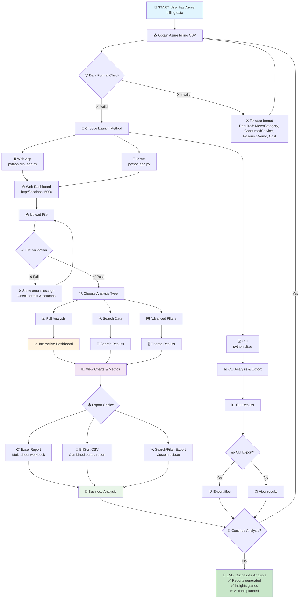

# 📊 Visual Flowchart: Microsoft Fabric Bill Analyzer Workflow



## 🎯 Decision Points Explained

### 📥 Data Preparation Decision Point
- **Input**: Azure billing data in various formats
- **Validation**: Check for required columns
- **Action**: Fix format if invalid, proceed if valid

### 🚀 Launch Method Decision Point  
- **Web App (Recommended)**: Best for most users, full featured
- **CLI (Advanced)**: Best for automation, batch processing
- **Direct Run**: Manual setup, for developers

### 🔍 Analysis Type Decision Point
- **Full Analysis**: Complete dashboard with all features
- **Search**: Find specific resources or services
- **Advanced Filters**: Multi-dimensional filtering

### 📤 Export Decision Point
- **Excel Report**: Comprehensive multi-sheet analysis
- **BillSort CSV**: Standardized sorted format  
- **Custom Export**: Filtered or searched results

## 🔄 User Journey Paths

### 👤 Business Analyst Path
```
Data → Web App → Upload → Full Analysis → Excel Export → Business Decisions
```

### 👩‍💻 Developer Path  
```
Data → CLI → Automated Analysis → API Integration → Ongoing Monitoring
```

### 🔍 Investigation Path
```
Data → Web App → Search/Filter → Targeted Analysis → Custom Export → Action Items
```

### 📊 Executive Path
```
Data → Web App → Quick Analysis → Interactive Charts → Presentation Export
```

## 🎨 Feature Interaction Map

```
┌─────────────────────────────────────────────────────────────┐
│                    Core Features                            │
│                                                             │
│  📊 Interactive Charts ←→ 📤 Export Functions               │
│         ↕                        ↕                         │
│  🔍 Search & Filter ←→ 📋 Combined Sorted Report            │
│         ↕                        ↕                         │
│  🎛️ Advanced Filters ←→ 💾 Multi-format Export            │
│                                                             │
└─────────────────────────────────────────────────────────────┘
```

## 📱 Responsive Design Flow

The application adapts to different screen sizes:

- **🖥️ Desktop**: Full dashboard with all charts visible
- **📱 Tablet**: Stacked charts, touch-friendly controls  
- **📱 Mobile**: Single-column layout, swipe navigation

---

This visual flowchart complements the detailed workflow diagram to provide users with both high-level flow understanding and detailed step-by-step guidance.
